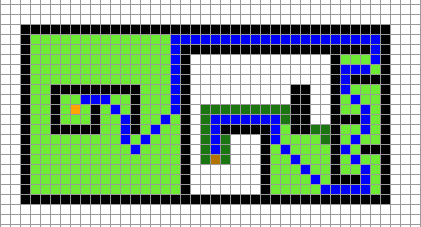

# Commands
Use a left click to place the starting position, the next left click to place the destination. Then place all the obstacles as you please with left clicks. A right click cancels the blocks placed.  
The yellow one is the starting position, the bronze one the destination, the blue path is the shortest one found by the heuristic algorithm and the green block are the blocks considered for the path before it found the shortest path.  
  

ESC to close  
P for pacman effect  
C to clear the board  
E to toggle showing the algorithm cycle by cycle  
D to toggle diagonals(just to make clear toggles bishop moves like in chess)  
UP and DOWN to fast or slow the algorithm  
S to save \
Space to start 
## 1 or 2 or 3 or 4 or 5 for different heuristics: 
1 = "dijkstra" No information given for the position of the destination  
2 = "taxicab" No diagonals  
3 = "taxicabdiagonal" Excellent time with diagonals  
4 = "distance"  Linear distance / Good time  
5 = "maxdistance" Excess moves / sure shortest for diagonals   
