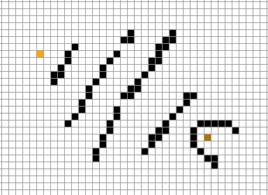
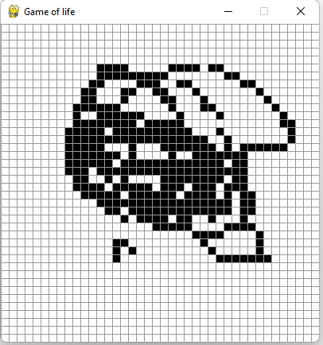

# PygameProjects 

## A star
The project is a visual representation of the A star algorithm implementing a grid setup where is possible to place obstacles and follow step by step the decision-making that the algo utilizes. It's also possible to modify the heuristics implemented, spot the differences, toggle the use of diagonals and toggle the "Pac-Man" space(a valid path could go left and appear on the right side of the window).  

## Conway's Game of Life
Simple implementation of the game of life with a toggle "Pac-Man" effect(the glider will appear on the opposite side of the window).  

